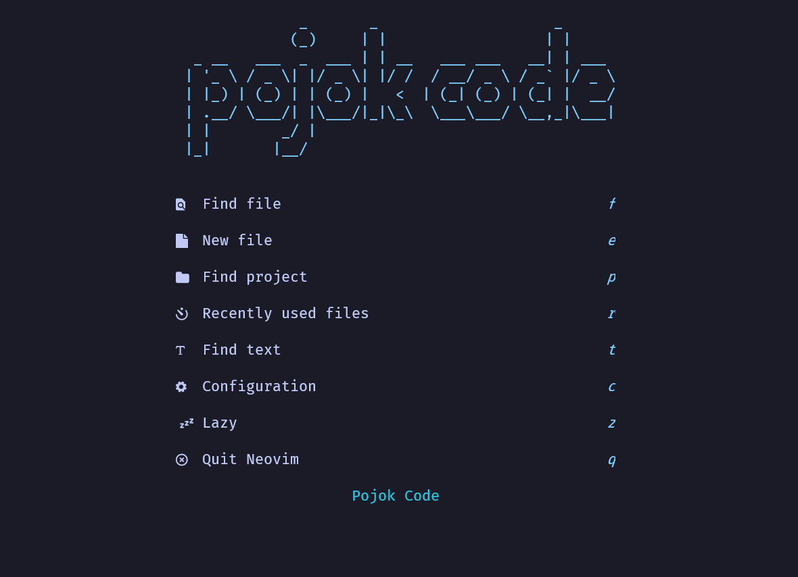
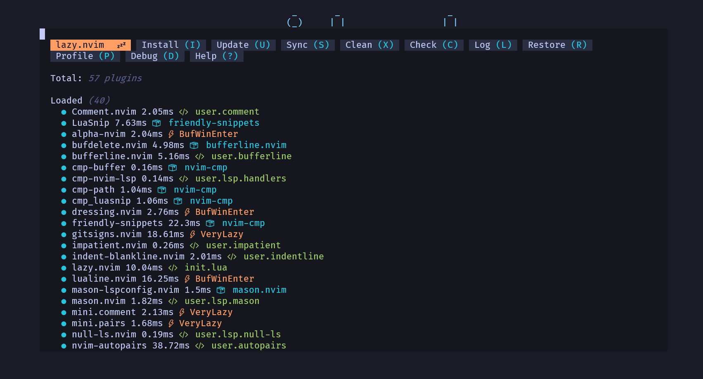
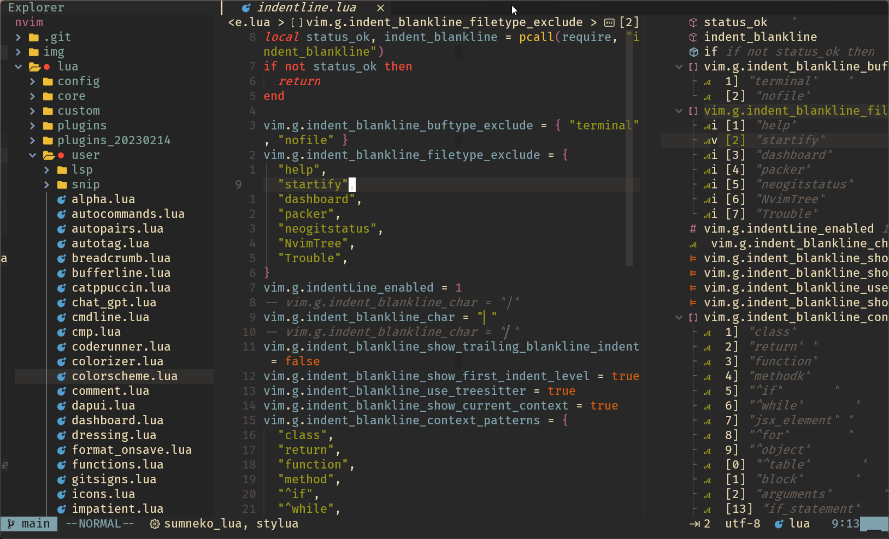

<div align="center">

# Nvim-Lazy


<p align="center">
  <a href="https://github.com/pojokcodeid/nvim-lazy/pulse">
    
  </a>
  <a href="https://github.com/pojokcodeid/nvim-lazy/latest">
    
  </a>
  <a href="https://github.com/pojokcodeid/nvim-lazy/stargazers">
    
  </a>
  <a href="https://github.com/pojokcodeid/nvim-lazy/blob/main/LICENSE"></a>
  <a href="https://github.com/pojokcodeid/nvim-lazy/issues">
  
    </a>
  </a>
  <a href="https://github.com/pojokcodeid/nvim-lazy">
      
    </a>
    <a href="https://twitter.com/intent/follow?screen_name=pojokcodeid_">
      
    </a>
</p>

</div>

## HOME



## Demo


## Treesitter dan LSP


## Plugins Manager



<!-- ## Layout -->

<!--  -->

# Panduan Install Dan Konfigurasi NeoVim

## Kunjungi <a href="https://github.com/pojokcodeid/nvim-lazy/wiki/">Wiki</a>

## Kebutuhan Dasar

1. Install Neovim 8.0+ https://github.com/neovim/neovim/releases/tag/v0.8.3
2. C++ (windows) Compiler https://www.msys2.org/
3. GIT https://git-scm.com/download/win
4. NodeJs https://nodejs.org/en/
5. Ripgrep https://github.com/BurntSushi/ripgrep
6. Lazygit https://github.com/jesseduffield/lazygit
7. Nerd Font https://github.com/ryanoasis/nerd-fonts
8. Windows Terminal (Windows) https://apps.microsoft.com/store/detail/windows-terminal/9N0DX20HK701?hl=en-id&gl=id
9. Powershell (windows) https://apps.microsoft.com/store/detail/powershell/9MZ1SNWT0N5D?hl=en-id&gl=id

# Windows

```
git clone https://github.com/pojokcodeid/nvim-lazy-basic.git "$env:LOCALAPPDATA\nvim"
nvim
```

# Linux

```bash
git clone https://github.com/pojokcodeid/nvim-lazy-basic.git ~/.config/nvim
```

## Terima Kasih

https://github.com/LunarVim/Neovim-from-scratch <br>
https://github.com/AstroNvim/AstroNvim
