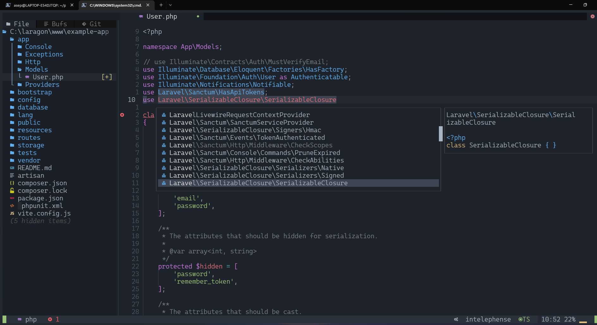

<h1 align="center">Nvim-Lazy</h1>

<p align="center">
  
  
  <a href="#">
    
  </a>
  <a href="#">
    
  </a>
</p>

## HOME


## Plugins Manager


## PHP



## JAVA


# Panduan Install Dan Konfigurasi NeoVim

## Kebutuhan Dasar

1. Install Neovim 8.0+ https://github.com/neovim/neovim/releases/tag/v0.8.2
2. C++ (windows) Compiler https://www.msys2.org/
3. GIT https://git-scm.com/download/win
4. NodeJs https://nodejs.org/en/
5. Ripgrep https://github.com/BurntSushi/ripgrep
6. Lazygit https://github.com/jesseduffield/lazygit
7. Nerd Font https://github.com/ryanoasis/nerd-fonts
8. Windows Terminal (Windows) https://apps.microsoft.com/store/detail/windows-terminal/9N0DX20HK701?hl=en-id&gl=id
9. Powershell (windows) https://apps.microsoft.com/store/detail/powershell/9MZ1SNWT0N5D?hl=en-id&gl=id

# Panduan Windows

- Pastikan sudah menginstall kebutuhan dasar diatas
- Jalankan Script Dibawah pada Powershell

```
git clone https://github.com/pojokcodeid/nvim-lazy-basic.git "$env:LOCALAPPDATA\nvim"
nvim
```

# Panduan Linux (Debian Based)

1.  Pastikan Acess Administrator

```
visudo
[nama user] ALL=(ALL:ALL) ALL
[nama user] ALL=(ALL) NOPASSWD:ALL
```

2. Install Neovim

```bash
sudo apt-get install wget
mkdir download
cd download
wget https://github.com/neovim/neovim/releases/download/v0.8.1/nvim-linux64.deb
sudo apt-get install ./nvim-linux64.deb
nvim --version
```

3. Check G++

```bash
g++ --version
```

4. Install NodeJS

```bash
sudo apt-get install curl
sudo apt install build-essential libssl-dev
curl -o- https://raw.githubusercontent.com/nvm-sh/nvm/v0.35.3/install.sh | bash
source ~/.bashrc
nvm install 18.13.0
node --version
npm --version
```

5. Install unzip, ripgrep

```bash
sudo apt-get install unzip
sudo apt-get install ripgrep
```

6. Install lazygit

```bash
LAZYGIT_VERSION=$(curl -s "https://api.github.com/repos/jesseduffield/lazygit/releases/latest" | grep '"tag_name":' |  sed -E 's/.*"v*([^"]+)".*/\1/')
curl -Lo lazygit.tar.gz "https://github.com/jesseduffield/lazygit/releases/latest/download/lazygit_${LAZYGIT_VERSION}_Linux_x86_64.tar.gz"
sudo tar xf lazygit.tar.gz -C /usr/local/bin lazygit
lazygit --version
```

7. Install Git

```bash
sudo apt-get install git
git --version
```

8.  Clone Config

```bash
git clone https://github.com/pojokcodeid/nvim-lazy-basic.git ~/.config/nvim
```

# Configurasi

- Struktur File <br>

```
  .
  ├── init.lua
  ├── lazy-lock.json
  ├── lua
  │   ├── custom
  │   │   ├── dashboard.lua
  │   │   ├── format_onsave.lua
  │   │   ├── lsp_installer.lua
  │   │   ├── null-ls.lua
  │   │   └── register_lsp.lua
  │   ├── default
  │   │   ├── autocommands.lua
  │   │   ├── init.lua
  │   │   ├── keymaps.lua
  │   │   ├── lazy.lua
  │   │   └── options.lua
  │   └── plugin
  │       ├── dapui.lua
  │       ├── init.lua
  │       └── lualine.lua
```

| Link                           | Keterangan                                                          |
|--------------------------------|---------------------------------------------------------------------|
| init.lua                       | (ini pintu masuk untuk config)                                      |
| lua/custom/dashborad.lua       | (ini digunkaan untuk custom dashboard)                              |
| lua/custom/format_onsave.lua   | (ini digunakan untuk setting ketika save mau di| format atau tidak) |
| lua/custom/lsp_installer.lua   | (ini digunakan untuk install LSP yang tidak| support mason)         |
| lua/custom/null-ls.lua         | (ini digunakan untuk registrasi formater dan linter)                |
| lua/custom/register_lsp.lua    | (ini untuk registrasi LSP yang tidak terbaca| langsung)             |
| lua/default/init.lua           | (pintu masuk acess config)                                          |
| lua/default/autocommands.lua   | (ini digunakan untuk custom autocommands)                           |
| lua/default/keymaps.lua        | (ini digunakan untuk custom key maps)                               |
| lua/default/lazy.lua           | (ini untuk plugin manager, jangan di ubah)                          |
| lua/default/options.lua        | (ini digunakan untuk overide default config nvim)                   |
| lua/plugin/\*                  | (ini digunakan untuk custom plugins, tambah dan override)           |

## KeyMap
- leader  = space bar
- n       = normal mode
<table>
<tr>
  <td>Mode</td>
	<td>Key</td>
	<td>Keterangan</td>
</tr>
<tr>
  <td>n</td>
	<td>leader</td>
	<td>Membuka Wich Key</td>
</tr>
</table>
## Config LSP

- Jalankan dengan commond mode

```
:MasonInstall html-lsp css-lsp typescript-language-server
```

- jika tidak terbaca lspnya tambahkan pada file lua/custom/register_lsp.lua
- Rujukan Lnguage Support <br>
  https://github.com/williamboman/mason.nvim/blob/main/PACKAGES.md

## Comfig Treesitter

- Jalankan Code Berikut pada command

```lua
:TSInstall html css javascript ..... dst
```

- Rujukan Language Support <br>
  https://github.com/nvim-treesitter/nvim-treesitter#supported-languages

## Ubah Dashboard

### Cari File lua/custom/dashboard.lua

- Edit Bagian ini

```lua
M.dashboard = {
	[[                               __                ]],
	[[  ___     ___    ___   __  __ /\_\    ___ ___    ]],
	[[ / _ `\  / __`\ / __`\/\ \/\ \\/\ \  / __` __`\  ]],
	[[/\ \/\ \/\  __//\ \_\ \ \ \_/ |\ \ \/\ \/\ \/\ \ ]],
	[[\ \_\ \_\ \____\ \____/\ \___/  \ \_\ \_\ \_\ \_\]],
	[[ \/_/\/_/\/____/\/___/  \/__/    \/_/\/_/\/_/\/_/]],
}

```

- Link Generate Dasboard
  https://patorjk.com/software/taag/

## Seting Bahasa Pemprograman

- https://youtube.com/playlist?list=PLhzwHCJWMbnvhPy0wqZGVBRUEAgS93iuk

## List Plugins

- <a href="https://github.com/folke/lazy.nvim">Lazy </a>
- <a href="https://github.com/nvim-lua/plenary.nvim">Plenary </a>
- <a href="https://github.com/windwp/nvim-autopairs">Nvim-Autopairs </a>
- <a href="https://github.com/numToStr/Comment.nvim">Comment.nvim</a>
- <a href="https://github.com/JoosepAlviste/nvim-ts-context-commentstring">nvim-ts-context-commentstring</a>
- <a href="https://github.com/nvim-tree/nvim-web-devicons">nvim-web-devicons</a>
- <a href="https://github.com/nvim-tree/nvim-tree.lua">nvim-tree.lua</a>
- <a href="https://github.com/akinsho/bufferline.nvim">bufferline.nvim</a>
- <a href="https://github.com/moll/vim-bbye">vim-bbye</a>
- <a href="https://github.com/akinsho/toggleterm.nvim">toggleterm.nvim</a>
- <a href="https://github.com/lewis6991/impatient.nvim">impatient.nvim</a>
- <a href="https://github.com/lukas-reineke/indent-blankline.nvim">indent-blankline.nvim</a>
- <a href="https://github.com/goolord/alpha-nvim">alpha-nvim</a>
- <a href="https://github.com/folke/which-key.nvim">which-key.nvim</a>
- <a href="https://github.com/folke/tokyonight.nvim">tokyonight.nvim</a>
- <a href="https://github.com/hrsh7th/nvim-cmp">nvim-cmp</a>
- <a href="https://github.com/hrsh7th/cmp-buffer">cmp-buffer</a>

## key lazygit

<a href="https://github.com/jesseduffield/lazygit/blob/master/docs/keybindings/Keybindings_en.md?fbclid=IwAR3BogewbYeP0PbPY1pewCkq2c3PKua3eHi-00rHpdSdz9gSKrY71Pv10u4" target="_blank">Key Lazygit</a>

## Terima Kasih

https://github.com/LunarVim/Neovim-from-scratch <br>
https://github.com/AstroNvim/AstroNvim
