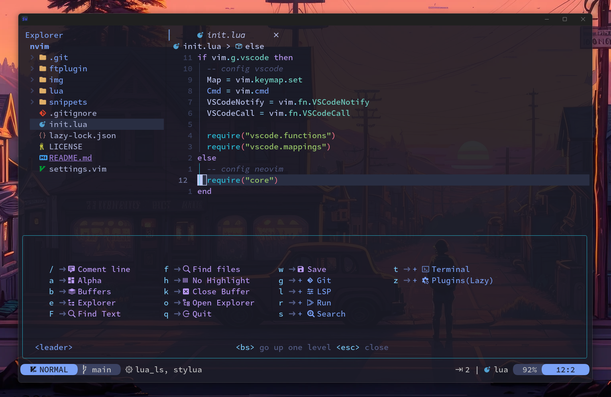
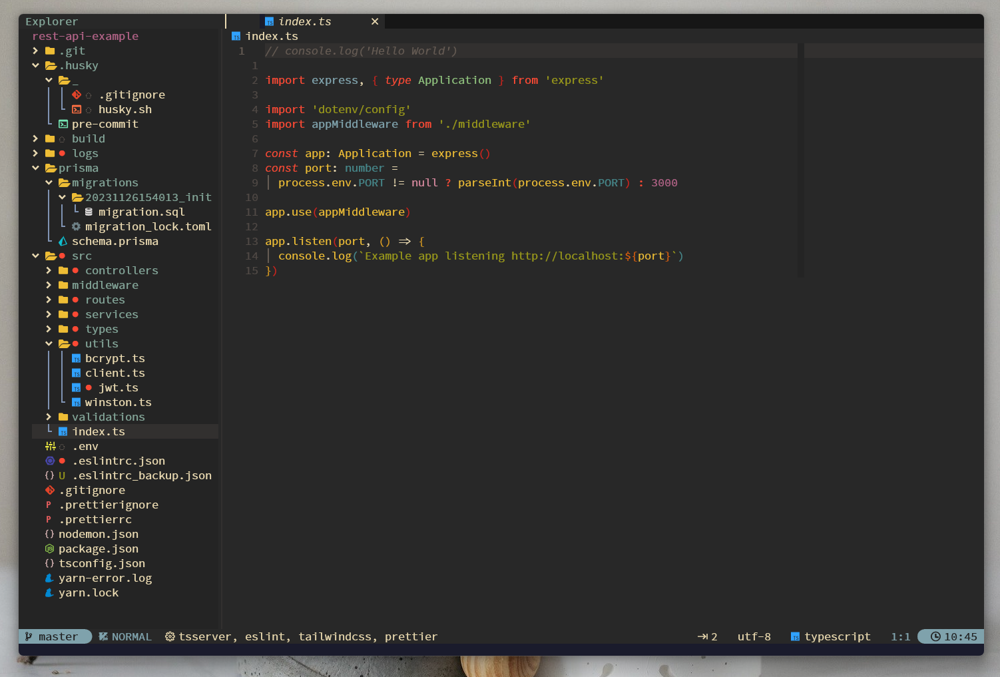

<div align="center">

# Nvim-Lazy


<p align="center">
  <a href="https://github.com/pojokcodeid/nvim-lazy/pulse">
    
  </a>
  <a href="https://github.com/pojokcodeid/nvim-lazy/latest">
    
  </a>
  <a href="https://github.com/pojokcodeid/nvim-lazy/stargazers">
    
  </a>
  <a href="https://github.com/pojokcodeid/nvim-lazy/blob/main/LICENSE"></a>
  <a href="https://github.com/pojokcodeid/nvim-lazy/issues">
  
    </a>
  </a>
  <a href="https://github.com/pojokcodeid/nvim-lazy">
      
    </a>
    <a href="https://twitter.com/intent/follow?screen_name=pojokcodeid_">
      
    </a>
</p>

</div>

## HOME


## Transparant



## Demo


## Treesitter dan LSP


## Plugins Manager


## Javascript Project



<!-- ## Layout -->

<!--  -->

# NeoVim Install & Configuration Guide

## Visit <a href="https://github.com/pojokcodeid/nvim-lazy/wiki/">Wiki</a>

## Basic Requirement

2. Install Neovim 0.95+ https://github.com/neovim/neovim/releases/tag/stable
1. C++ https://www.msys2.org/
1. GIT https://git-scm.com/download/win
1. NodeJs https://nodejs.org/en/
1. Ripgrep https://github.com/BurntSushi/ripgrep
1. Lazygit https://github.com/jesseduffield/lazygit
1. Nerd Font https://www.nerdfonts.com/ or https://github.com/ryanoasis/nerd-fonts
1. Windows Terminal (Windows) https://apps.microsoft.com/store/detail/windows-terminal/9N0DX20HK701?hl=en-id&gl=id
1. Powershell (windows) https://apps.microsoft.com/store/detail/powershell/9MZ1SNWT0N5D?hl=en-id&gl=id

# Windows

```
git clone https://github.com/pojokcodeid/neovim-starter.git "$env:LOCALAPPDATA\nvim"
nvim
```

# Linux

```bash
git clone https://github.com/pojokcodeid/neovim-starter.git ~/.config/nvim
```

# Uninstall

```bash
# Linux / MacOS (unix)
rm -rf ~/.config/nvim
rm -rf ~/.local/state/nvim
rm -rf ~/.local/share/nvim

# Flatpak (linux)
rm -rf ~/.var/app/io.neovim.nvim/config/nvim
rm -rf ~/.var/app/io.neovim.nvim/data/nvim
rm -rf ~/.var/app/io.neovim.nvim/.local/state/nvim

# Windows CMD
rd -r ~\AppData\Local\nvim
rd -r ~\AppData\Local\nvim-data

# Windows PowerShell
rm -Force ~\AppData\Local\nvim
rm -Force ~\AppData\Local\nvim-data
```

# Shortcut Most-Used

<table>
  <tr>
    <td>:q or :quit</td>
    <td>exit the form</td>
  </tr>
  <tr>
    <td>:w or :write</td>
    <td>write the typing result into a file (save)</td>
  </tr>
  <tr>
    <td>:wq</td>
    <td>save and exit</td>
  </tr>
  <tr>
    <td>:q!</td>
    <td>Exit and do not save</td>
  </tr>
  <tr>
    <td>escape</td>
    <td>normal mode</td>
  </tr>
  <tr>
    <td>i</td>
    <td>insert mode</td>
  </tr>
  <tr>
    <td>v</td>
    <td>visual mode, must be in normal mode first</td>
  </tr>
  <tr>
    <td>h</td>
    <td>left</td>
  </tr>
  <tr>
    <td>j</td>
    <td>down</td>
  </tr>
  <tr>
    <td>k</td>
    <td>up</td>
  </tr>
  <tr>
    <td>l</td>
    <td>right</td>
  </tr>
  <tr>
    <td>:ter</td>
    <td>open the terminal</td>
  </tr>
  <tr>
    <td>0 or home</td>
    <td>move the cursor to the beginning of the line</td>
  </tr>
  <tr>
    <td>$ or end</td>
    <td>move the cursor to the end of the line</td>
  </tr>
  <tr>
    <td>gg</td>
    <td>move the cursor to the top</td>
  </tr>
  <tr>
    <td>G</td>
    <td>move the cursor to the end of the page</td>
  </tr>
  <tr>
    <td>w</td>
    <td>move the cursor to the next word with out spaces</td>
  </tr>
  <tr>
    <td>3w</td>
    <td>move the cursor to the next 3 words</td>
  </tr>
  <tr>
    <td>b</td>
    <td>move the cursor to the previous word</td>
  </tr>
  <tr>
    <td>3b</td>
    <td>move the cursor to the previous 3 words</td>
  </tr>
  <tr>
    <td>(</td>
    <td>move the cursor to the previous paragraph</td>
  </tr>
  <tr>
    <td>)</td>
    <td>move the cursor to the next paragraph</td>
  </tr>
  <tr>
    <td>dd</td>
    <td>delete text 1 line</td>
  </tr>
  <tr>
    <td>d$</td>
    <td>delete words until the end of the line from the cursor position</td>
  </tr>
  <tr>
    <td>d0</td>
    <td>
      delete words until the beginning of the line from the cursor position
    </td>
  </tr>
  <tr>
    <td>U</td>
    <td>to undo</td>
  </tr>
  <tr>
    <td>CTRL + r</td>
    <td>Rendo</td>
  </tr>
  <tr>
    <td>Yp</td>
    <td>duplicate line code</td>
  </tr>
  <tr>
    <td>yyp</td>
    <td>same duplicate line code</td>
  </tr>
  <tr>
    <td>:m+1</td>
    <td>move 1 line down</td>
  </tr>
  <tr>
    <td>:m-1</td>
    <td>move 1 line up</td>
  </tr>
  <tr>
    <td>d</td>
    <td>delete code that is selected with view mode</td>
  </tr>
  <tr>
    <td>:e newfolder/newfile.ext</td>
    <td>create a new file in a new folder</td>
  </tr>
  <tr>
    <td>:f newfolder/newfile.ext</td>
    <td>to copy the file from the open file</td>
  </tr>
  <tr>
    <td>bdw</td>
    <td>delete 1 word</td>
  </tr>
  <tr>
    <td>dw</td>
    <td>delete to the right in 1 word at the cursor position</td>
  </tr>
</table>

## Thanks To

https://github.com/LunarVim/Neovim-from-scratch <br>
https://github.com/AstroNvim/AstroNvim
